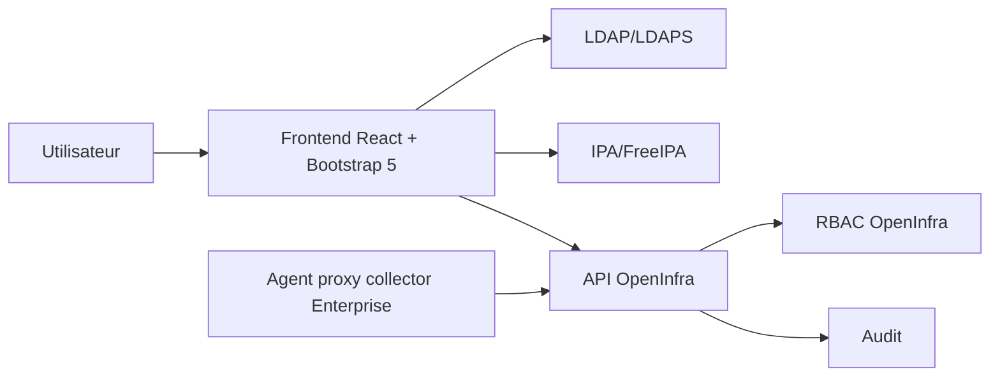

# Authentification LDAP/IPA et RBAC groupes

## Architecture

Les éditions Pro et Entreprise doivent intégrer un adaptateur d'identité externe capable de se connecter à LDAP/LDAPS et IPA/FreeIPA pour l'authentification opérateur portée par le frontend web. L'adaptateur appartient à la couche infrastructure et expose au domaine une identité normalisée.

Le backend reste API-only pour les opérateurs : il ne réalise pas de login LDAP/IPA direct. Il valide les jetons applicatifs émis après authentification frontend, applique les permissions RBAC OpenInfra effectives et journalise les décisions d'autorisation.



## Règles techniques

- Lite reste strictement local et n'utilise jamais LDAP/IPA.
- LDAP/IPA est autorisé uniquement pour les scopes web Pro/Entreprise.
- Le backend n'authentifie pas directement chaque opérateur humain par LDAP/IPA.
- Le frontend authentifie l'opérateur puis consomme l'API backend avec un jeton applicatif.
- Les agents proxy collectors Enterprise consomment l'API backend avec un mécanisme technique d'enrôlement, jamais avec un login opérateur. Lite et Pro n'exécutent aucune collecte via agent distribué : les backends servers sont seuls responsables de la collecte.
- Les mots de passe ou secrets de bind ne sont jamais loggés.
- Les certificats TLS LDAP/IPA doivent être validés.
- Les groupes externes sont mappés vers des rôles applicatifs OpenInfra.
- Les sessions et tokens portent les permissions effectives calculées par OpenInfra.
- Un changement de mapping doit invalider les sessions concernées selon la politique configurée.

## Configuration minimale Pro/Entreprise web

```yaml id="6mdlob"
auth:
  providers:
    ldap_ipa:
      enabled: true
      scope: frontend_web_only
      type: ldap_or_ipa
      url: ldaps://ipa.example.net:636
      base_dn: dc=example,dc=net
      user_filter: "(uid={username})"
      group_filter: "(member={user_dn})"
      bind_dn_ref: env:OPENINFRA_LDAP_BIND_DN
      bind_password_ref: env:OPENINFRA_LDAP_BIND_PASSWORD
      tls_required: true
      nested_groups: true
      cache_ttl_seconds: 300
```

## RBAC

Le RBAC doit rester interne à OpenInfra. LDAP/IPA fournit l'identité et l'appartenance groupe ; OpenInfra décide des droits applicatifs. Le backend applique l'autorisation finale à chaque appel API, même lorsque le frontend masque déjà des actions non autorisées côté interface.

## Sécurisation des échanges

Hors Lite, les échanges frontend-backend, agent-proxy-backend et backend-backend imposent TLS 1.3 avec authentification mutuelle mTLS. Les certificats, clés privées et secrets LDAP/IPA sont référencés uniquement via `env:`, `file://`, `vault://`, `sops://` ou `kms://`.

## Break-glass

Un compte local break-glass peut exister uniquement pour Pro/Entreprise si :

- il est désactivable ;
- il est audité ;
- il est protégé par MFA si disponible ;
- son usage déclenche une alerte ;
- sa rotation est imposée.
