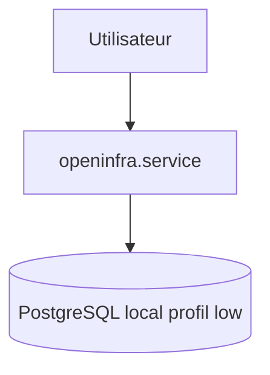
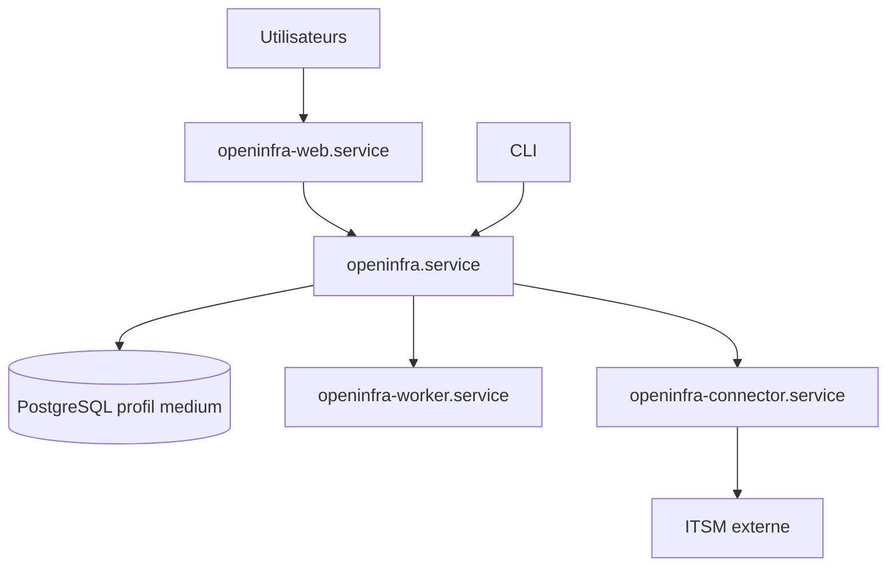
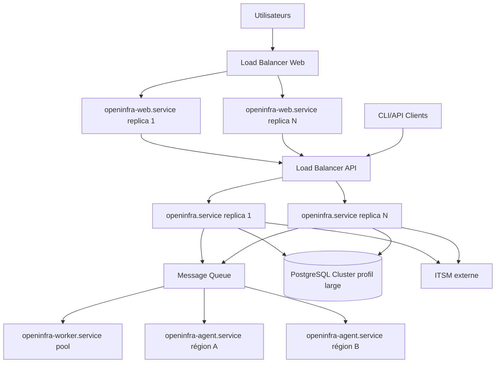

# Architecture cible par édition

## Vue synthétique

| Domaine | Lite | Pro | Entreprise |
|---|---|---|---|
| Déploiement | Monolithique | Backend + Web + DB séparables | Backend cluster + Web cluster + Agents + Workers + DB HA |
| Service principal | `openinfra.service` | `openinfra.service` | `openinfra.service` |
| Frontend | intégré | `openinfra-web.service` | `openinfra-web.service` en replicas |
| Agent discovery distant | non | non | `openinfra-agent.service` |
| Workers asynchrones | non | oui | oui, scalables |
| PostgreSQL | local/simple | medium, cluster optionnel | large, cluster optionnel, partitionnement obligatoire |
| ITSM externe | non | oui | oui |
| Quotas | stricts | stricts | illimités |

## Architecture Lite

## Architecture Pro

## Architecture Entreprise

## Règles communes

- Le frontend ne doit jamais accéder directement à PostgreSQL.
- Les agents ne doivent jamais écrire directement dans PostgreSQL.
- Les connecteurs ITSM ne doivent jamais contourner l'API backend.
- Les décisions d'autorisation sont prises côté backend.
- Les feature gates sont appliqués côté backend et testés par édition.
- Les migrations doivent rester compatibles avec toutes les éditions supportées.

