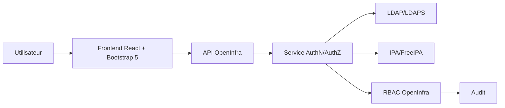

# Authentification LDAP/IPA et RBAC groupes

## Architecture

Les éditions Pro et Entreprise doivent intégrer un adaptateur d'identité externe capable de se connecter à LDAP/LDAPS et IPA/FreeIPA. L'adaptateur appartient à la couche infrastructure et expose au domaine une identité normalisée.



## Règles techniques

- Le frontend ne gère jamais directement LDAP/IPA.
- Le backend est l'unique composant autorisé à valider l'identité externe.
- Les mots de passe ou secrets de bind ne sont jamais loggés.
- Les certificats TLS LDAP/IPA doivent être validés.
- Les groupes externes sont mappés vers des rôles applicatifs.
- Les sessions et tokens portent les permissions effectives calculées.
- Un changement de mapping doit invalider les sessions concernées selon la politique configurée.

## Configuration minimale Pro/Entreprise

```yaml id="6mdlob"
auth:
  providers:
    ldap_ipa:
      enabled: true
      type: ldap_or_ipa
      url: ldaps://ipa.example.net:636
      base_dn: dc=example,dc=net
      user_filter: "(uid={username})"
      group_filter: "(member={user_dn})"
      tls_required: true
      nested_groups: true
      cache_ttl_seconds: 300
```

## RBAC

Le RBAC doit rester interne à OpenInfra. LDAP/IPA fournit l'identité et l'appartenance groupe ; OpenInfra décide des droits applicatifs.

## Break-glass

Un compte local break-glass peut exister uniquement pour Pro/Entreprise si :

- il est désactivable ;
- il est audité ;
- il est protégé par MFA si disponible ;
- son usage déclenche une alerte ;
- sa rotation est imposée.

## v0.29.10 — P07 authentification LDAP/IPA et RBAC groupes

- Lite reste strictement limité à l'authentification locale `standard`.
- Pro et Enterprise acceptent une politique LDAP/IPA uniquement côté backend/server.
- Le frontend ne se connecte jamais directement à LDAP/IPA.
- Les secrets de bind LDAP/IPA restent des références `env:`, `vault://`, `sops://`, `file://` ou `kms://`.
- Les groupes externes sont mappés explicitement vers des rôles OpenInfra ; l'annuaire authentifie l'identité mais n'autorise jamais les actions applicatives.
- L'émission des tokens applicatifs est basée sur les rôles OpenInfra effectifs.
- Les connexions externes réussies sont auditées sans journaliser les mots de passe, DN utilisateur en clair dans les payloads publics ou secrets de bind.
